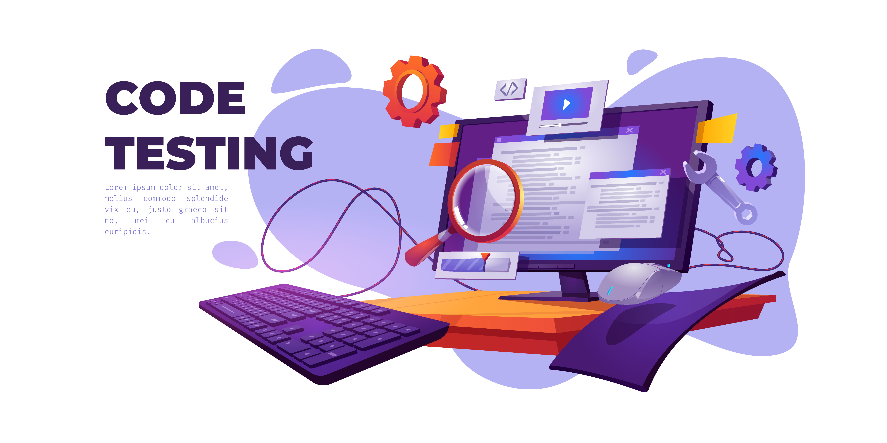
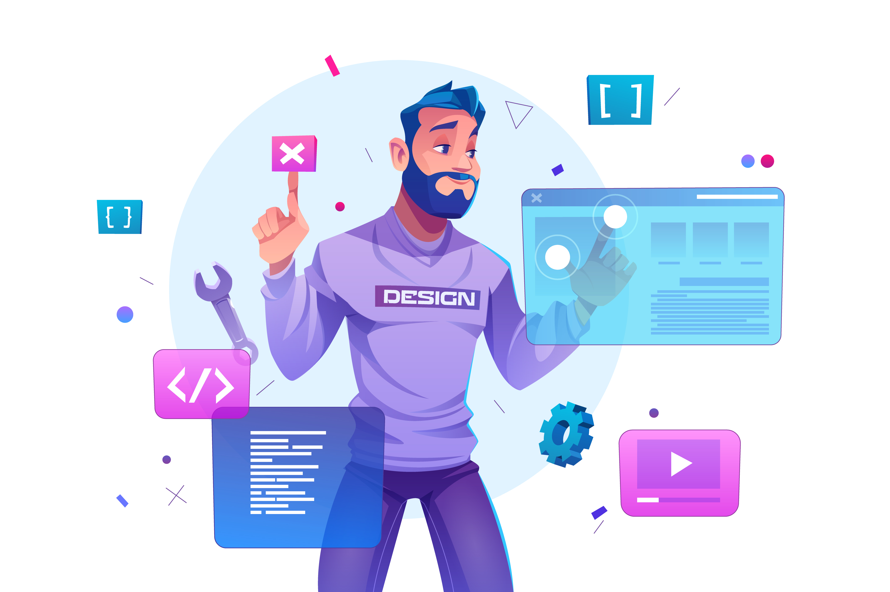

<h1 align="center">Hi 👋, I'm Osama Mirghani</h1>
<!-- <h3 align="center">A passionate frontend engineer from Sudan</h3> -->

- 🌱 I’m currently learning about **Agentic AI, Propmpt Engineering and Prduct Management**

- 💬 Ask me about **ReactJS, NodeJS, Agile, AWS**

- 📫 How to reach me **osamamirghani95@gmail.com**

<h3 align="left">Connect with me:</h3>

